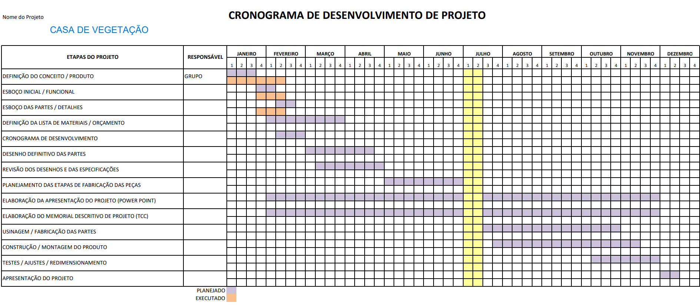
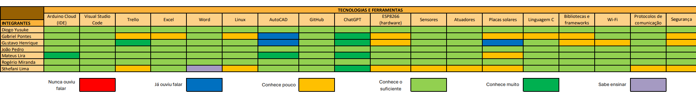
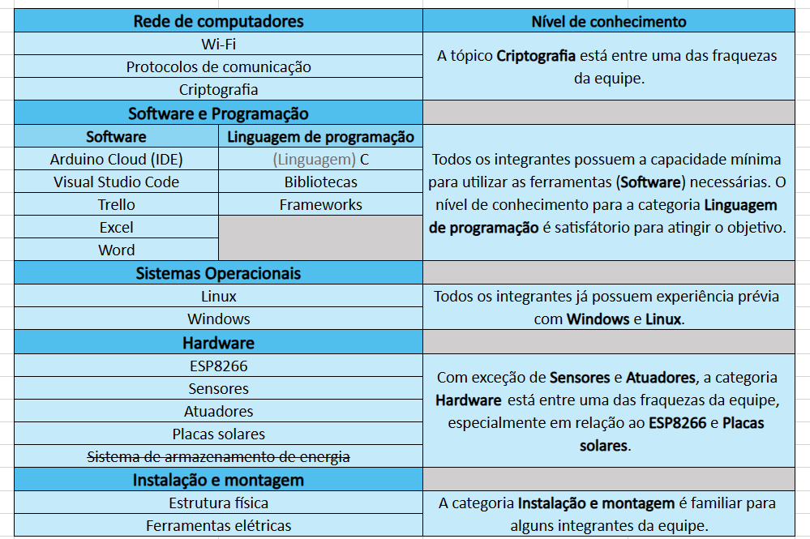

# Casa Vegetativa

Este repositório apresenta o código-fonte da casa vegetativa programada em linguagem C com o **ESP8266**.

O objetivo principal é entregar uma Casa Vegetativa completamente funcional, equipada com sensores para monitoramento de luminosidade, umidade do solo e do ar, temperatura, além de sistemas automatizados de irrigação e iluminação. Além disso, caso viável e dentro do prazo, busca-se a integração de um sistema de energia renovável, preferencialmente por meio de placas solares, para maximizar a sustentabilidade e reduzir custos operacionais.

## Escopo do projeto

- **Pesquisa de materiais**: Identificação e seleção dos materiais mais adequados para a construção da estufa, levando em consideração durabilidade, eficiência energética e custo-benefício;

- **Projeto e construção da estufa**: Responsabilidade da equipe em realizar o planejamento e execução da estrutura física da casa vegetativa, garantindo sua integridade e funcionalidade;

- **Implementação dos sistemas de monitoramento e automação**: Instalação e configuração dos sensores de luminosidade, umidade do solo, umidade do ar e temperatura, bem como dos sistemas automatizados de irrigação e iluminação;

- **Integração de energia renovável**: Caso viável, incorporação de um sistema de energia alimentado por placas solares, com o objetivo de promover a sustentabilidade e reduzir a dependência de fontes convencionais de energia.

## Cronograma

## Matriz de habilidades

## Mapa de conhecimento

**OBS:** No dia 30/03, o código foi alterado para uma linguagem "híbrida" de C e C++.
